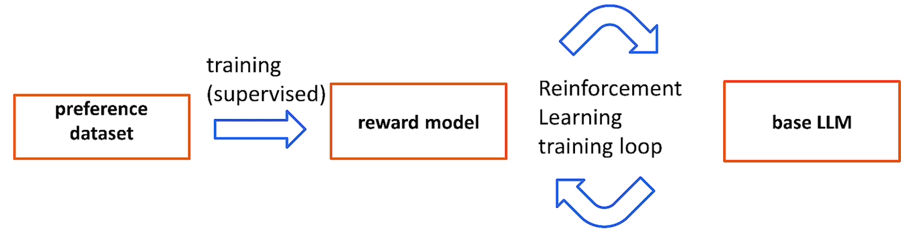
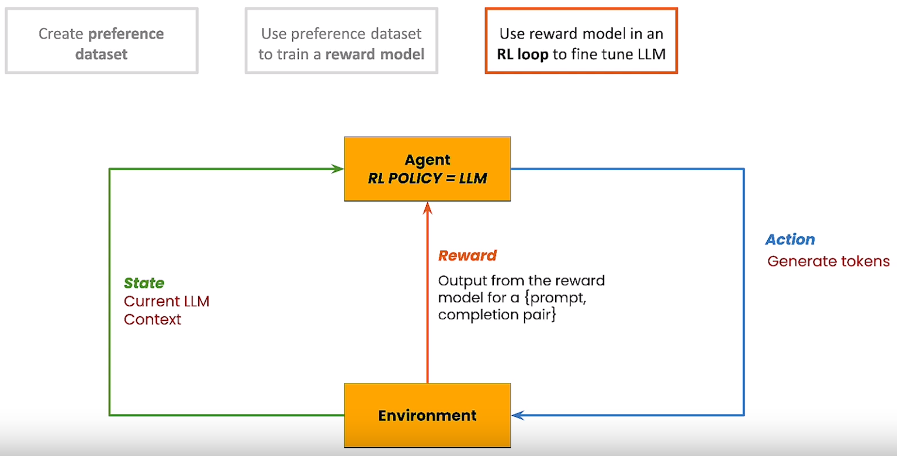
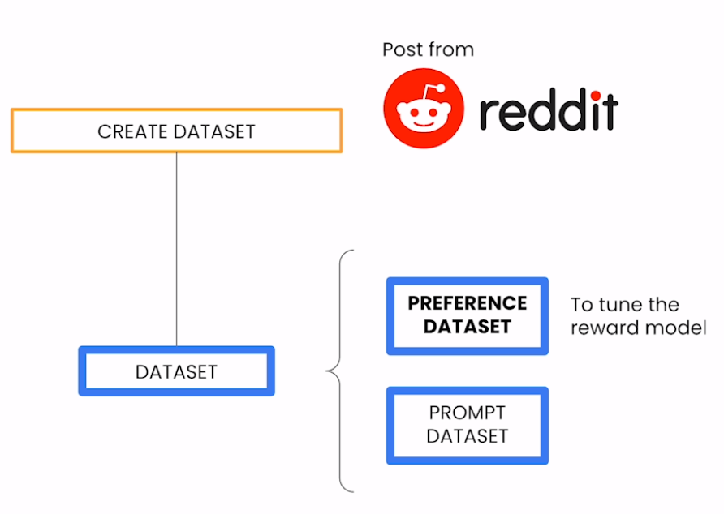
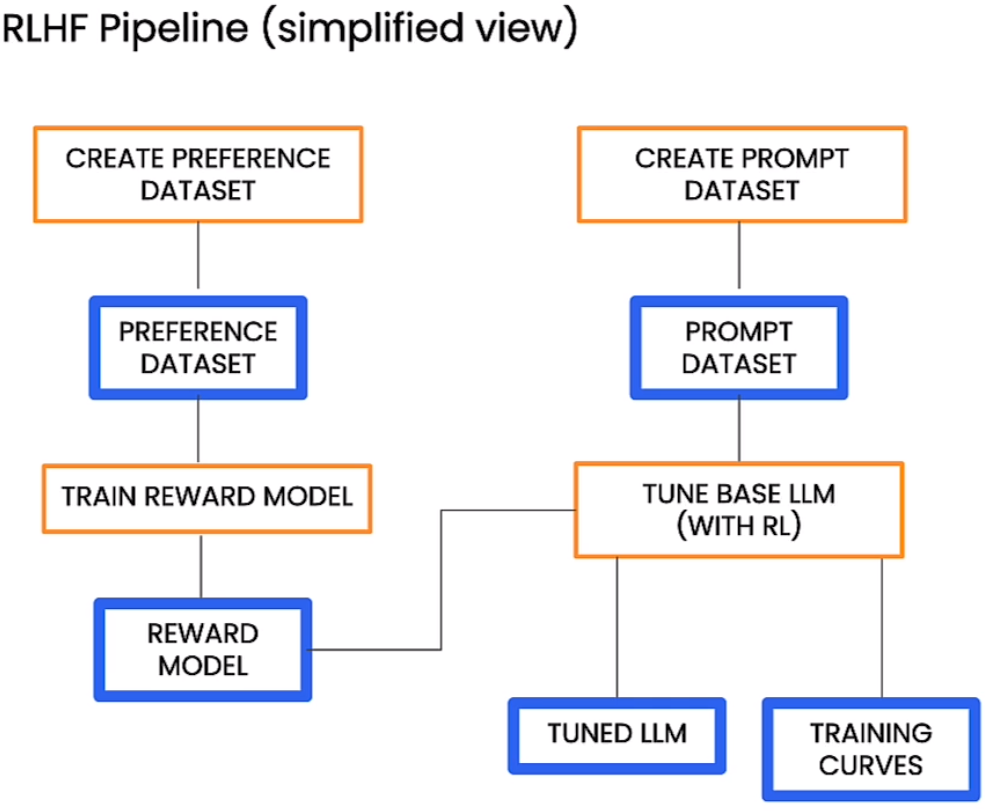

# 🚀 [Reinforcement Learning from Human Feedback](https://www.deeplearning.ai/short-courses/reinforcement-learning-from-human-feedback/)

💻 Welcome to the "Reinforcement Learning from Human Feedback" course! This course, instructed by Nikita Namjoshi, Developer Advocate for Generative AI at Google Cloud, will guide you through the process of aligning Large Language Models (LLMs) with human values and preferences using Reinforcement Learning from Human Feedback (RLHF).

## Course Summary
In this course, you will dive into the world of RLHF and its application in aligning LLMs with human values. Here's what you can expect to learn and experience:

1. 📚 **Conceptual Understanding of RLHF**: Explore the RLHF training process and understand the importance of aligning LLMs with human values and preferences. 
    **Supervised Fine Tuning :** {input text, summary} 
    **RLHF :**                   {input text, summary 1, summary 2, human preference}

 
 

2. 📊 **Datasets for RLHF Training**: Examine the "preference" and "prompt" datasets crucial for RLHF training.

 

3. ⚙️ **Fine-Tuning with Google Cloud Pipeline Components Library**: Practice fine-tuning the Llama 2 model using RLHF and the open-source Google Cloud Pipeline Components Library.

 

4. 📈 **Model Evaluation**: Assess the tuned LLM against the original base model using loss curves and the "Side-by-Side (SxS)" method.

## Key Points
- 🔑 Gain a conceptual understanding of RLHF and the datasets required for this technique.
- 🛠 Fine-tune the Llama 2 model using RLHF with the open-source Google Cloud Pipeline Components Library.
- 🧐 Evaluate the performance of the tuned model against the base model using various evaluation methods.

## About the Instructor
🌟 **Nikita Namjoshi** is a Developer Advocate for Generative AI at Google Cloud. With expertise in the field, Nikita will guide you through the intricacies of RLHF.

🔗 To enroll in the course or for further information, visit [deeplearning.ai](https://www.deeplearning.ai/short-courses/).
